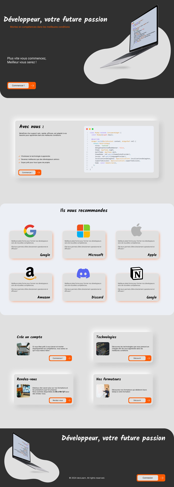

# DevLearn

> Dev Learn is an exercise I undertook as part of my studies. The aim was to recreate a website mock-up using SCSS.

## About The Project

After building the website in CSS, we had to convert it to SCSS and adopt the workflow used for SCSS projects. The website also had to be responsive.

## Built With

* HTML5 
* SCSS (Sass)
* Git & GitHub

## Website
> My Website : [raphael-turchi.fr](https://raphael-turchi.fr/)